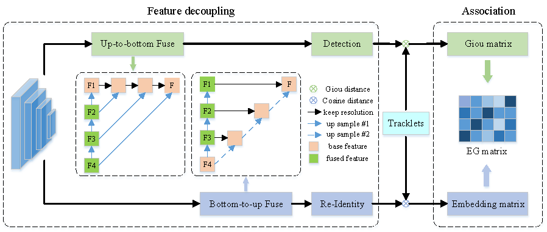
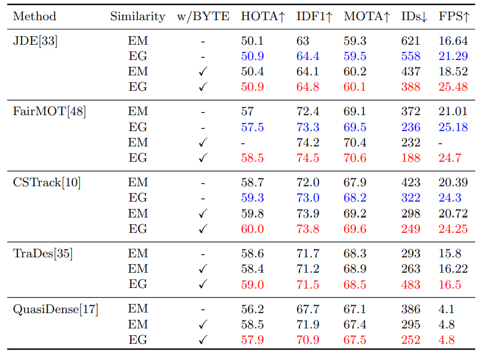

# SimpleTrack: Rethinking and Improving the JDE fromApproach for Multi-Object Tracking
> [**SimpleTrack: Rethinking and Improving the JDE fromApproach for Multi-Object Tracking**](https://arxiv.org/abs/2203.03985v1)
> 
> Jiaxin Li, Yan Ding, Hua-Liang Wei, Yutong Zhang and Wenxiang Lin
> 
> *[arXiv 2203.03985v1](https://arxiv.org/abs/2203.03985v1)*
A simple baseline for [SimpleTrack](https://arxiv.org/abs/2203.03985v1):

> [**SimpleTrack: Rethinking and Improving a JDE fromApproach for Multi-Object Tracking**]
## Abstract
Joint detection and embedding (JDE) methods usually estimate bounding boxes and embedding features of objects with a single
network in Multi-Object Tracking (MOT). Most JDE methods improve
tracking accuracy by designing more efficient network structures. However, in the tracking stage, they fuse the target motion information and
appearance information following the same rule, which could fail when
the target is briefly lost or blocked. To mitigate this problem, we propose a new association matrix, called the EG matrix, which combines
embedding cosine distance and Giou distance of objects. We apply the
EG matrix to 5 different state-of-the-art JDE trackers and achieve significant improvements in IDF1, HOTA and, IDsw metrics and increase
the tracking speed of these methods by about 20%. To further utilize the
EG matrix, we introduce a simple, effective tracker named SimpleTrack,
which utilizes a decouple method for objects detection and Re-identity
and fuses BYTE and EG matrix for tracking.

## News
* TODO

## Tracking performance
### Results on other JDE methods


## Installation
* Clone this repo, and we'll call the directory that you cloned as ${SimpleTrack_ROOT}
* Install dependencies. We use python 3.7 and pytorch >= 1.7.0
```
conda create -n SimpleTrack
conda activate SimpleTrack
conda install pytorch==1.7.1 torchvision==0.8.2 cudatoolkit=10.1 -c pytorch
cd ${SimpleTrack_ROOT}
pip install -r requirements.txt
```
* We use [DCNv2](https://github.com/CharlesShang/DCNv2) in our backbone network and more details can be found in their repo. 
```
git clone https://github.com/CharlesShang/DCNv2
cd DCNv2
./make.sh
```

## Data preparation
Followed Fairmot
* **CrowdHuman**
The CrowdHuman dataset can be downloaded from their [official webpage](https://www.crowdhuman.org). After downloading, you should prepare the data in the following structure:
```
crowdhuman
   |——————images
   |        └——————train
   |        └——————val
   └——————labels_with_ids
   |         └——————train(empty)
   |         └——————val(empty)
   └------annotation_train.odgt
   └------annotation_val.odgt
```
Then, you can change the paths in src/gen_labels_crowd.py and run:
```
cd src
python gen_labels_crowd.py
```
* **MIX**
We use the same training data as [JDE](https://github.com/Zhongdao/Towards-Realtime-MOT) in this part and we call it "MIX". Please refer to their [DATA ZOO](https://github.com/Zhongdao/Towards-Realtime-MOT/blob/master/DATASET_ZOO.md) to download and prepare all the training data including Caltech Pedestrian, CityPersons, CUHK-SYSU, PRW, ETHZ, MOT17 and MOT16. 
* **2DMOT15 and MOT20** 
[2DMOT15](https://motchallenge.net/data/2D_MOT_2015/) and [MOT20](https://motchallenge.net/data/MOT20/) can be downloaded from the official webpage of MOT challenge. After downloading, you should prepare the data in the following structure:
```
MOT15
   |——————images
   |        └——————train
   |        └——————test
   └——————labels_with_ids
            └——————train(empty)
MOT20
   |——————images
   |        └——————train
   |        └——————test
   └——————labels_with_ids
            └——————train(empty)
```
Then, you can change the seq_root and label_root in src/gen_labels_15.py and src/gen_labels_20.py and run:
```
cd src
python gen_labels_15.py
python gen_labels_20.py
```
to generate the labels of 2DMOT15 and MOT20. The seqinfo.ini files of 2DMOT15 can be downloaded here [[Google]](https://drive.google.com/open?id=1kJYySZy7wyETH4fKMzgJrYUrTfxKlN1w), [[Baidu],code:8o0w](https://pan.baidu.com/s/1zb5tBW7-YTzWOXpd9IzS0g).

## Pretrained models and baseline model
* **Pretrained models**

DLA-34 COCO pretrained model: [DLA-34 official](https://drive.google.com/file/d/1pl_-ael8wERdUREEnaIfqOV_VF2bEVRT/view).
HRNetV2 ImageNet pretrained model: [HRNetV2-W18 official](https://1drv.ms/u/s!Aus8VCZ_C_33cMkPimlmClRvmpw), [HRNetV2-W32 official](https://1drv.ms/u/s!Aus8VCZ_C_33dYBMemi9xOUFR0w).
After downloading, you should put the pretrained models in the following structure:
```
${SimpleTrack_ROOT}
   └——————models
           └——————ctdet_coco_dla_2x.pth
           └——————hrnetv2_w32_imagenet_pretrained.pth
           └——————hrnetv2_w18_imagenet_pretrained.pth
```
* **Baseline model**

Our baseline SimpleTrack model (DLA-34 backbone) is pretrained on the CrowdHuman for 60 epochs with the self-supervised learning approach and then trained on the MIX dataset for 30 epochs. The models can be downloaded here: 
crowdhuman_simple.pth [[Google]](https://drive.google.com/file/d/1-56EBROznvWT5fU6OopyQ6aTYq5JUY9N/view?usp=sharing) [[Baidu, code:simp ]](https://pan.baidu.com/s/1m5tYuJ-l9veaYAYkYhB8AQ) 
SimpleTrack.pth [[Google]](https://drive.google.com/file/d/1t6BYhkZlx7CUnkTIsVHEQLIhVzDDh8mn/view?usp=sharing) [[Baidu, code:simp ]](https://pan.baidu.com/s/1m5tYuJ-l9veaYAYkYhB8AQ). (This is the model we get 61.0 HOTA on the MOT17 test set. )
After downloading, you should put the baseline model in the following structure:
```
${FAIRMOT_ROOT}
   └——————models
           SimpleTrack.pth
           └——————...
```

## Training
* Download the training data
* Change the dataset root directory 'root' in src/lib/cfg/data.json and 'data_dir' in src/lib/opts.py
* Pretrain on CrowdHuman and train on MIX:
```
sh experiments/crowdhuman_dla34.sh
sh experiments/mix_ft_ch_simpletrack.sh
```
## Tracking
* For ablation study, we evaluate on the other half of the training set of MOT17, you can run:
```
cd src
python track_half.py mot --load_model ../models/crowdhuman_simple.pth --conf_thres 0.3 --val_mot17 True
```
If you use our pretrained model 'crowdhuman_simple.pth', you can get 72.5 MOTA and 78.5 IDF1. 
* To get the txt results of the test set of MOT17, you can run:
```
cd src
python track.py mot --test_mot17 True --load_model ../models/SimpleTrack.pth --conf_thres 0.3
```
and send the txt files to the [MOT challenge](https://motchallenge.net) evaluation server to get the results. (You can get the SOTA results 74+ MOTA on MOT17 test set using the baseline model 'SimpleTrack.pth'.)

## Test EG matrix on other JDE methods
Please see the tutorials folder.

## Evaluation
run the TrackEval-master/scripts/run_mot_challenge.py. (Have converted code for half dataset test)

## Acknowledgement
A large part of the code is borrowed from [ifzhang/FairMOT](https://github.com/ifzhang/FairMOT), [ifzhang/ByteTrack](https://github.com/ifzhang/ByteTrack). Thanks for their wonderful works.

## Citation

```
@misc{https://doi.org/10.48550/arxiv.2203.03985,
  doi = {10.48550/ARXIV.2203.03985},
  url = {https://arxiv.org/abs/2203.03985},
  author = {Li, Jiaxin and Ding, Yan and Wei, Hualiang},
  keywords = {Computer Vision and Pattern Recognition (cs.CV), FOS: Computer and information sciences, FOS: Computer and information sciences},
  title = {SimpleTrack: Rethinking and Improving the JDE Approach for Multi-Object Tracking},
  publisher = {arXiv},
  year = {2022},
  copyright = {arXiv.org perpetual, non-exclusive license}
}
```

